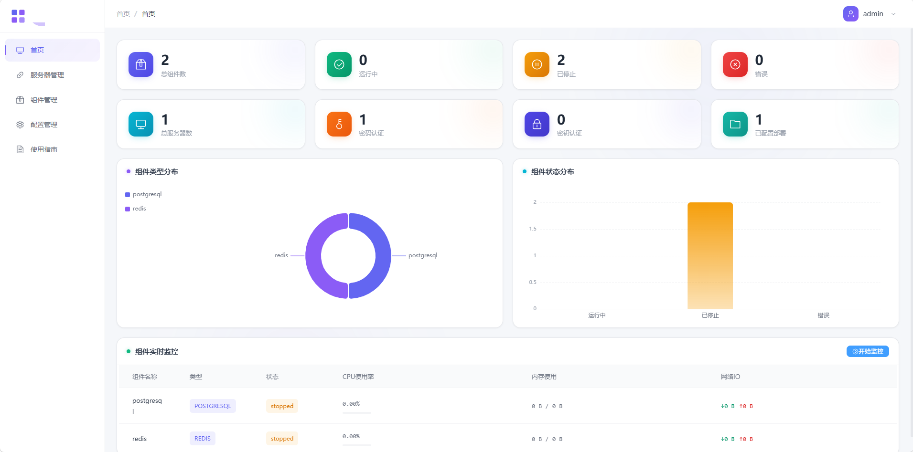
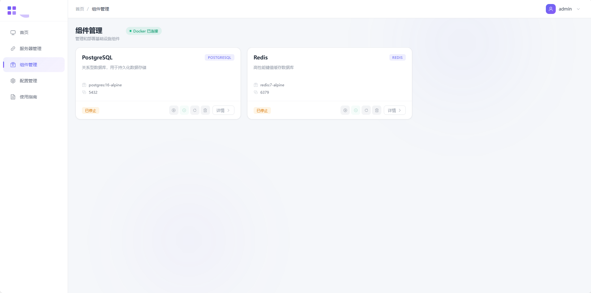
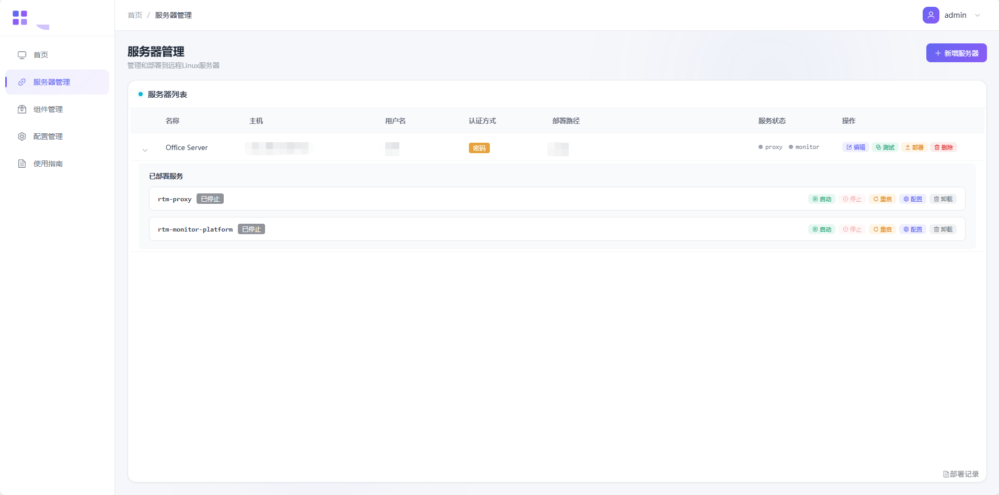
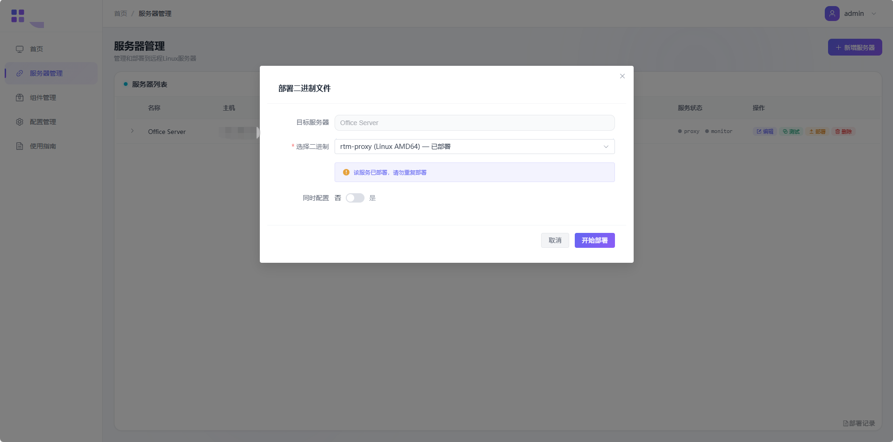
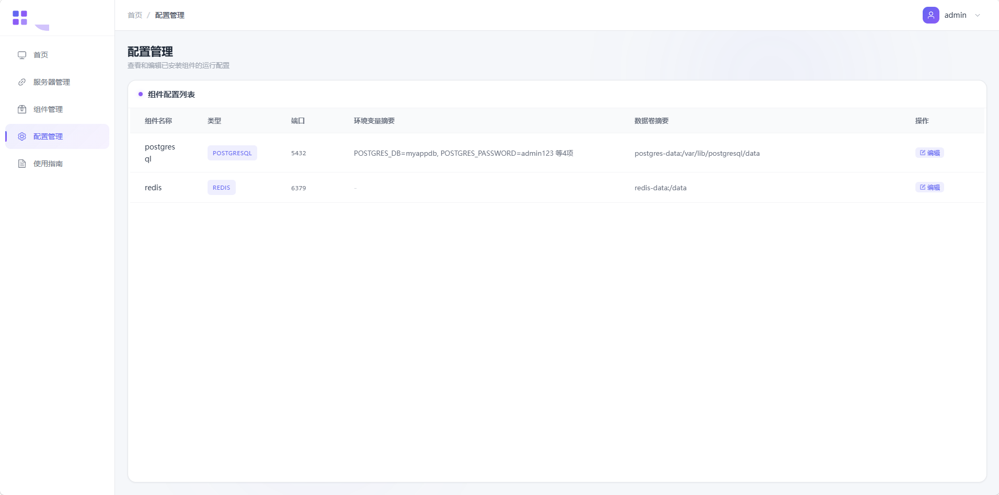
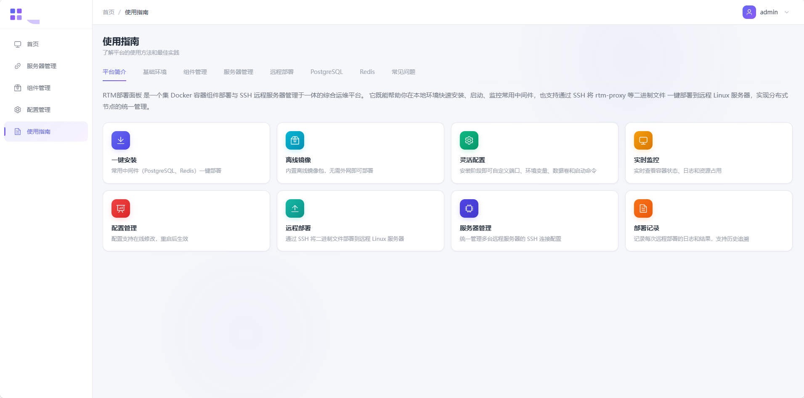

# OpenTraffic Ops 部署面板

<p align="center">
  <a href="../LICENSE"></a>
  
  
  
</p>

<p align="center">
  
  
  
</p>

<p align="center">
  <a href="README.md">English</a>
</p>

## 📑 目录

- [📖 项目简介](#项目简介)
  - [核心能力](#核心能力)
  - [单二进制自包含部署](#单二进制自包含部署)
- [🔧 技术栈](#技术栈)
  - [后端](#后端)
  - [前端](#前端)
- [✨ 功能描述](#功能描述)
  - [📊 监控大屏](#监控大屏)
  - [🧩 组件管理](#组件管理)
  - [🖧 服务器管理](#服务器管理)
  - [📦 远程部署](#远程部署)
  - [⚙️ 配置管理](#配置管理)
  - [📖 使用指南](#使用指南)
- [🚀 快速开始](#快速开始)
  - [📋 前置要求](#前置要求)
  - [💻 开发模式启动](#开发模式启动)
- [🖥️ 服务器部署](#服务器部署)
  - [📦 生产构建](#生产构建单包自包含)
  - [⚙️ 配置说明](#配置说明)
  - [🔒 安全建议](#安全建议)
  - [💾 备份策略](#备份策略)
- [❓ 常见问题](#常见问题)
- [🙏 致谢](#致谢)

---

## 📖 项目简介

OpenTraffic Ops 部署面板是一个**单二进制、自包含**的综合运维平台，集成了 **Docker 容器组件管理** 与 **SSH 远程服务器部署** 两大核心能力。后端由单一 Go HTTP 服务提供，前端通过 `go:embed` 嵌入二进制，**无需额外安装 Nginx 或配置反向代理**——只需运行一个二进制文件即可启动完整服务。

### 🎯 核心能力

| 能力 | 说明 |
|------|------|
| Docker 组件管理 | 一键安装、启动、停止、卸载常用中间件（PostgreSQL、Redis），支持自定义端口、环境变量、数据卷和启动命令 |
| 实时监控 | 查看组件实时资源占用（CPU / 内存 / 网络 / 磁盘），支持日志实时刷新和自动刷新 |
| SSH 服务器管理 | 统一管理多台远程 Linux 服务器的 SSH 连接配置，支持密码和密钥两种认证方式 |
| 远程二进制部署 | 通过 SSH/SFTP 将 opentraffic-ops-proxy 和 opentraffic-ops 二进制文件一键部署到远程服务器 |
| 远程配置管理 | 在线查看和编辑远程服务器上的软件配置文件（proxy 的 config.json、平台的 config.yaml） |
| 远程服务管理 | 通过 PID 文件管理远程服务的启动、停止、重启，无需 root 权限 |
| 部署记录追溯 | 完整记录每次远程部署的操作日志、执行结果和历史记录 |

### 📦 单二进制自包含部署

本项目的核心设计目标之一是**消除对外部 Web 服务器（如 Nginx）的依赖**。前端 `dist` 目录通过 `go:embed` 直接嵌入 Go 二进制中，配合自定义 SPA Fallback Handler，使得直接访问 `/components` 等路由或刷新页面都能正常工作。最终产物始终是**单个自包含二进制文件**——复制即可运行。

---

## 🔧 技术栈

### 后端

| 技术 | 说明 |
|------|------|
| Go 1.21+ | 编程语言 |
| Gin | Web 框架 |
| SQLite | 零外部依赖的嵌入式数据库 |
| Docker SDK for Go | 容器生命周期管理 |
| `golang.org/x/crypto/ssh` | SSH 客户端实现 |
| JWT | 认证授权 |
| `go:embed` + 自定义 SPA Fallback | 无需 Nginx 的静态文件托管 |
| AES-GCM | 敏感信息加密（SSH 密码、私钥） |

### 前端

| 技术 | 说明 |
|------|------|
| Vue 3 + TypeScript | 前端框架 |
| Element Plus | UI 组件库 |
| Vite | 构建工具 |
| Pinia | 状态管理 |
| ECharts | 数据可视化 |
| `createWebHistory` | History 模式路由 |

---

## ✨ 功能描述

### 📊 监控大屏
- 组件统计卡片（总数 / 运行中 / 已停止 / 错误）
- 服务器统计卡片（总数 / 密码认证 / 密钥认证 / 已配置部署）
- 组件类型分布饼图
- 组件状态分布柱状图
- 组件实时监控表格（CPU / 内存 / 网络 IO），支持启停实时刷新



### 🧩 组件管理
- 组件目录浏览，显示 Docker 连接状态
- 一键安装组件（PostgreSQL、Redis）
- 安装时自定义：组件名称、端口、环境变量、数据卷、启动命令参数
- 启动 / 停止 / 重启 / 卸载已安装组件
- 查看组件详情（资源监控、日志、配置信息）
- 内置离线镜像，无需外网即可部署



#### 支持的组件类型

| 组件 | 类型 | 默认镜像 | 说明 |
|------|------|---------|------|
| PostgreSQL | `postgresql` | `postgres:16-alpine` | 关系型数据库 |
| Redis | `redis` | `redis:7-alpine` | 内存缓存 / 键值数据库 |

### 🖧 服务器管理
- 新增 / 编辑 / 删除远程服务器 SSH 配置
- 支持两种认证方式：密码认证和密钥认证（支持带 Passphrase 的私钥）
- SSH 连接测试
- 服务器列表展示服务状态（proxy / monitor / control）
- 展开行查看已部署服务详情
- 支持的操作：启动 / 停止 / 重启 / 配置 / 卸载远程服务；control 算法包支持启动 / 停止 / 重启 / 配置 / 卸载，配置路径为 `{deploy_path}/opentraffic-control/config/mq_config.json`



### 📦 远程部署
- 选择目标服务器，部署内置二进制文件（`opentraffic-ops-proxy`、`opentraffic-ops`）
- 部署 `opentraffic-control` 算法包（tar 压缩包）到远程服务器，自动识别架构（amd64 / arm64 / loong64），支持版本记录
- **龙芯 LoongArch64**：采用 Python 环境包（`trafficlight-loong64.tar.gz`，解压为 `trafficlight_env/`，含全部依赖）与算法包（`opentraffic-control-linux-loong64.tar`，预编译 .so）分离部署，Python 环境解压到部署目录 `{deploy_path}/opentraffic-control/trafficlight_env`，首次自动部署，后续只更新算法包，解压即用，无需板载编译
- **ARM aarch64**：采用 Python 环境包（`trafficlight-arm64.tar.gz`，解压为 `trafficlight_env/`，含全部依赖）与算法包（`opentraffic-control-linux-arm64.tar`）分离部署，Python 环境解压到部署目录 `{deploy_path}/opentraffic-control/trafficlight_env`，首次自动部署，后续只更新算法包，解压即用，无需 conda / pip / 编译环境
- 部署二进制文件时可选同时部署配置文件
- 支持加载默认配置模板
- 二进制文件防重复部署检测；算法包允许重复部署并保留版本历史
- 完整的部署记录和日志追溯



### ⚙️ 配置管理
- 查看所有已安装组件的配置列表
- 在线编辑组件配置（端口、环境变量、数据卷、启动命令）
- 配置保存后需手动重启组件生效



### 📖 使用指南
- 平台简介与特性概览
- 基础环境要求（Docker、浏览器、网络、SSH）
- 组件和服务器管理使用说明
- 远程部署流程说明
- PostgreSQL / Redis 默认配置与参数说明
- 常见问题 FAQ（手风琴式交互）



---

## 🚀 快速开始

### 📋 前置要求

- Go 1.21+
- Node.js 18+
- Docker & Docker Compose（本机运行时使用）
- Git

### 💻 开发模式启动

#### 1. 克隆项目

```bash
git clone <repository-url>
cd OpenTraffic-Ops-Initialization
```

#### 2. 启动后端

```bash
cd backend
go mod download
go run cmd/server/main.go
```

后端服务将在 `http://localhost:18080` 启动。

#### 3. 启动前端

```bash
cd frontend
npm install
npm run dev
```

前端服务将在 `http://localhost:5173` 启动，开发时通过 Vite Proxy 自动转发 `/api` 到 `http://localhost:18080`。

#### 4. 访问系统

打开浏览器访问 `http://localhost:5173`

默认登录账号：
- 用户名: `admin`
- 密码: `admin123`

#### Windows 本地开发快速调试（无需每次复制 dist）

开发阶段前端改动频繁。`backend/pkg/static/static.go` 中增加了环境变量开关，允许直接从磁盘加载前端资源：

```cmd
# 在 backend 目录下
set RTM_STATIC_DIR=..\frontend\dist
go run cmd\server\main.go
```

生产构建时**不要**设置该变量，确保前端资源被完整嵌入二进制。

---

## 🖥️ 服务器部署

### 📦 生产构建（单包自包含）

#### Windows 交叉编译 Linux 部署包

执行 `build-opentraffic-ops-initialization.bat` 生成 Linux AMD64、ARM64 和 Loong64 二进制：

```cmd
build-opentraffic-ops-initialization.bat
```

输出文件为：
- `backend\opentraffic-ops-init-linux-amd64`
- `backend\opentraffic-ops-init-linux-arm64`
- `backend\opentraffic-ops-init-linux-loong64`

上传至 Linux 服务器并运行：

```bash
chmod +x opentraffic-ops-init-linux-amd64
./opentraffic-ops-init-linux-amd64
```

### ⚙️ 配置说明

创建 `backend/.env` 文件：

```env
# 服务器配置
SERVER_HOST=0.0.0.0
SERVER_PORT=18080

# 数据库配置
DATA_DIR=./data

# JWT 配置
JWT_SECRET=your-secret-key-change-in-production
JWT_EXPIRE_HOURS=24

# 加密密钥（32 字节，用于加密 SSH 密码和私钥）
ENCRYPTION_KEY=your-encryption-key-32-bytes-long
```

### 🔒 安全建议

1. 修改默认管理员密码
2. 更换 JWT Secret 和加密密钥
3. 使用 HTTPS（可通过外部反向代理或负载均衡器终止 TLS）
4. 配置防火墙规则
5. 定期备份 SQLite 数据库

### 💾 备份策略

```bash
# 备份 SQLite 数据库
cp backend/data/opentraffic-ops-init.db backup/opentraffic-ops-init_$(date +%Y%m%d).db

# 备份 Docker volumes
docker run --rm \
  -v opentraffic-ops-init-data:/data \
  -v $(pwd)/backup:/backup \
  alpine tar czf /backup/opentraffic-ops-init-data_$(date +%Y%m%d).tar.gz /data
```

---

## ❓ 常见问题

### Docker 连接失败
- 确保 Docker 服务正在运行
- 检查 `/var/run/docker.sock` 权限

### 端口冲突
- 修改 `.env` 文件中的端口配置
- 确保端口未被占用

### 前端刷新 404
- 确认 `go build` 时 `frontend/dist` 已存在
- 检查 `backend/pkg/static/static.go` 中的 embed 路径是否正确

### 跨域问题
- 生产环境前后端同域，不应出现跨域
- 开发环境确保 Vite Proxy 配置正确且后端已启动

### SSH 连接测试失败
- 检查目标服务器的 SSH 服务是否正常运行
- 确认主机地址、端口、用户名、密码/私钥是否正确
- 检查防火墙是否放行了 SSH 端口

### 远程部署失败（权限不足）
- 检查 SSH 用户对部署路径是否有读写权限
- 确认部署路径所在磁盘有足够空间
- 检查目标服务器的 SELinux 或 AppArmor 限制

### 龙芯 LoongArch64 控制服务启动失败
- 确认首次部署时 `{deploy_path}/opentraffic-control/trafficlight_env/bin/python3` 已存在
- 执行 `file trafficlight_env/bin/python3` 确认显示 LoongArch 架构 ELF，架构不匹配说明环境包用错
- 检查 `config/mq_config.json` 中的 Redis 地址、端口、密码是否正确
- 查看 `{deploy_path}/opentraffic-control/run.log` 中的具体错误

### ARM aarch64 控制服务启动失败
- 确认首次部署时 `{deploy_path}/opentraffic-control/trafficlight_env/bin/python3` 已存在
- 执行 `file trafficlight_env/bin/python3` 确认显示 `ELF 64-bit LSB ... ARM aarch64`，架构不匹配说明环境包用错
- 检查 `config/mq_config.json` 中的 Redis 地址、端口、密码是否正确
- 查看 `{deploy_path}/opentraffic-control/run.log` 中的具体错误

### 组件容器启动失败（Permission denied）
- 使用绑定挂载时，确保宿主机目录的属主与容器默认用户 UID 一致
- PostgreSQL UID 为 70，Redis UID 为 999
- 推荐使用命名卷（如 `postgres-data:/var/lib/postgresql/data`），Docker 会自动处理权限

---

## 🙏 致谢

OpenTraffic Ops Init 基于以下开源项目构建：

- [Go](https://golang.org/) / [Gin](https://github.com/gin-gonic/gin) —— 后端框架
- [Vue.js](https://vuejs.org/) / [Vite](https://vitejs.dev/) —— 前端框架与构建工具
- [Element Plus](https://element-plus.org/) —— UI 组件库
- [Docker SDK for Go](https://github.com/docker/docker-ce) —— 容器管理
- [ECharts](https://echarts.apache.org/) —— 数据可视化

[Apache License 2.0](../LICENSE)
