# OpenTraffic Ops Monitoring & Operations Platform

[中文](README_CN.md)

## Table of Contents

- [Project Introduction](#project-introduction)
- [Tech Stack](#tech-stack)
- [Features](#features)
- [Quick Start](#quick-start)
- [Server Deployment](#server-deployment)
- [FAQ](#faq)
- [Acknowledgments](#acknowledgments)

---

## Project Introduction

OpenTraffic Ops is a full-stack monitoring and operations management platform for edge computing scenarios. It consists of two independent deliverables: **monitoring platform service** (backend with embedded frontend via `go:embed`, deployed as a single binary) and **edge proxy**, supporting host management, health metric collection, threshold alerting, remote operations (terminal / file / process), and Agent dialogue (control agent / perception agent).

> **Naming clarification**: **Edge Proxy** refers to the data collection/control program deployed on monitored hosts (deliverable in `proxy/`). **System Agent dialogue** (control agent / perception agent) is the business module for interfacing with external Agents. The two have different responsibilities — **Proxy** and **Agent** are used strictly below.

---

## Tech Stack

### Backend (`backend/`, Go module `opentraffic-ops-backend`)

| Technology | Version | Description |
|-----------|---------|-------------|
| Go | 1.25+ | Programming language |
| Gin | v1.10 | Web framework |
| GORM | v1.25 | ORM framework |
| PostgreSQL | 15+ | Primary database |
| Redis | 7+ | Platform cache / edge messaging (dual instances) |
| JWT v5 | v5.3 | Authentication |
| Gorilla WS | v1.5 | WebSocket (terminal, file) |
| Zap | v1.27 | Logging framework |
| Viper | v1.19 | Configuration management |

### Frontend (`frontend/`, Vue3 SPA)

| Technology | Version | Description |
|-----------|---------|-------------|
| Vue | 3.3 | Frontend framework |
| Vite | 5.x | Build tool |
| Element Plus | 2.8 | UI component library |
| Pinia | 2.1 | State management |
| ECharts | 5.4 | Data visualization |
| Axios | 1.7 | HTTP client |
| xterm.js | 5.3 | Browser terminal |

### Edge Proxy (`proxy/`, Go module `opentraffic-ops-proxy`, independent deliverable)

| Technology | Version | Description |
|-----------|---------|-------------|
| Go | 1.26+ | Programming language (**Linux only**) |
| gopsutil | v3 | Host metric collection |
| Gorilla WS | v1.5 | WebSocket long connection to platform |
| creack/pty | v1.1 | Remote terminal PTY implementation |

> Proxy and backend do not share code; they interact via HTTP/WS protocol. Can only run on Linux (amd64 / arm64); Windows is for cross-compilation only.

---

## Features

### System Management
- **User Management** — User CRUD, password policy, login failure lockout
- **Personal Center** — User info maintenance, password change, avatar upload

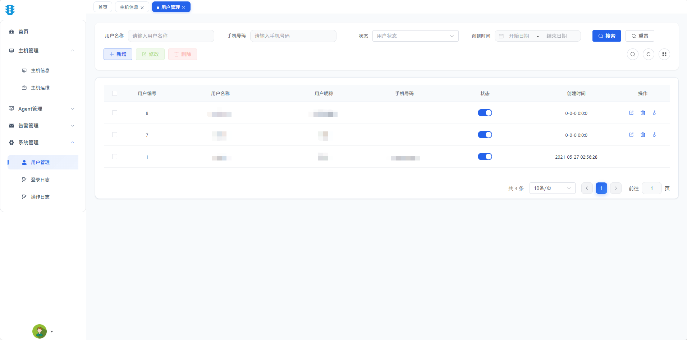

### Host Management
- **Host Information** — Edge node host registration, CRUD, and status display (auto-enrolled on first proxy registration)
- **Host Health** — Historical host health data collection and query (auto daily rotation, 7-day retention)
- **Host Operations** — Remote operations entry point (terminal, file, process control)

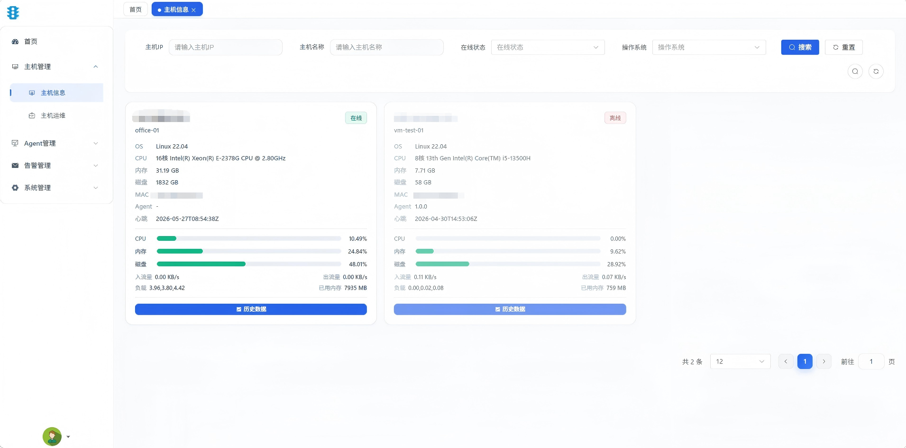

### Monitoring & Alerting
- **Alarm Channels** — Supports email, DingTalk, WeCom, and in-app notification channels, with multiple channels configurable
- **Alarm Rules** — Multi-dimensional rule orchestration:
  - Metric-based: CPU / memory / disk / network / load
  - Service-based: host offline, control Agent offline
- **Alarm Records** — Historical alarm query, confirmation, and recovery tracking
- **Alarm Notification Logs** — Detailed records of send status per channel
- **Built-in Scheduler** (no external cron dependency):
  - `dealOffline` (60s) — Host offline detection
  - `alarmCheck` (30s) — Alarm detection
  - `cleanHostHealth` (daily at 03:30) — Clean health data older than 7 days

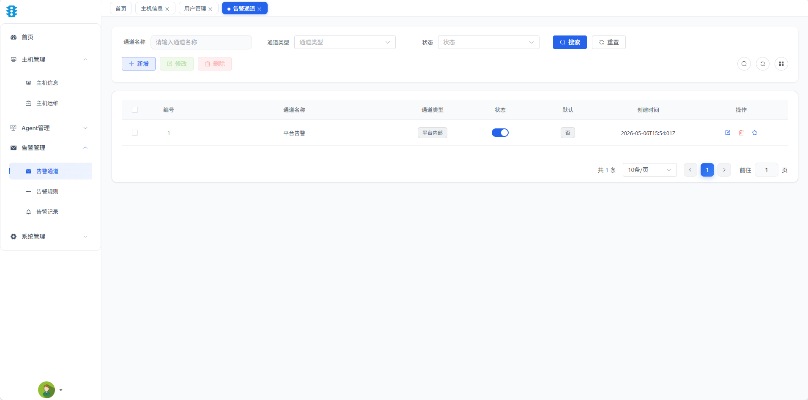
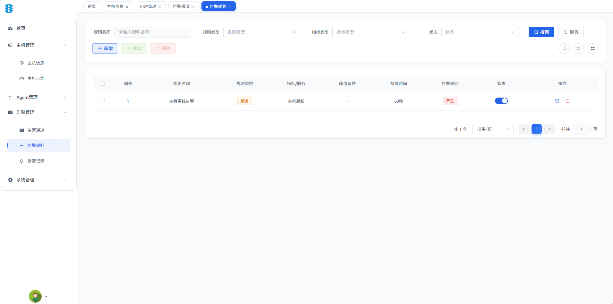
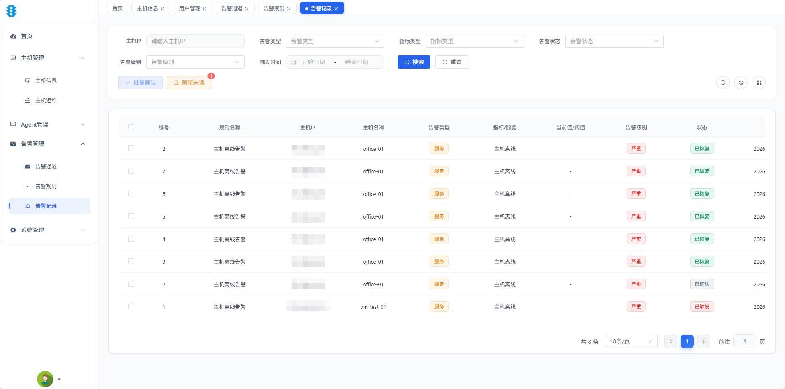

### Agent Dialogue
- **Control Agent Dialogue** — Interact with the control Agent through dialogue, executing process start/stop, parameter distribution, and other operations
- **Perception Agent Dialogue** — Interact with the perception Agent through dialogue, obtaining host online status and basic information
- **Session Management** — Session creation, paginated list, message history, rename, delete

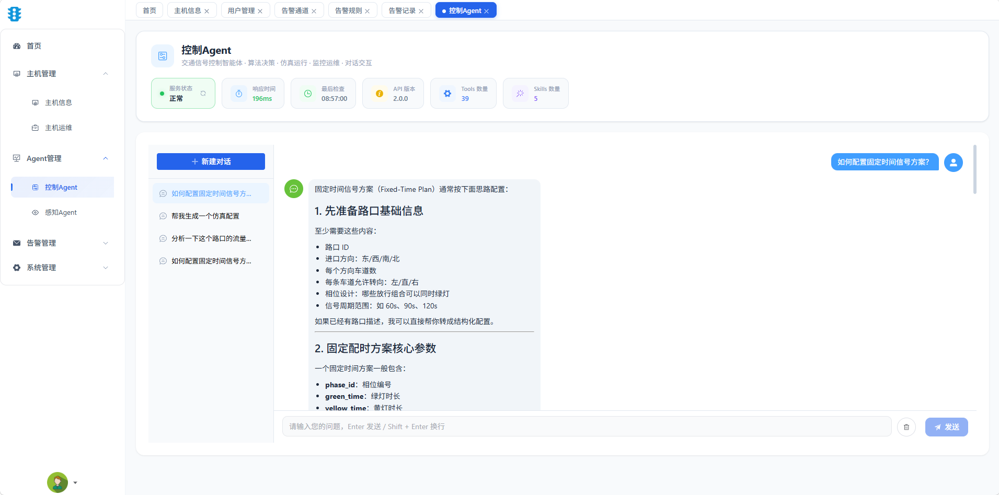
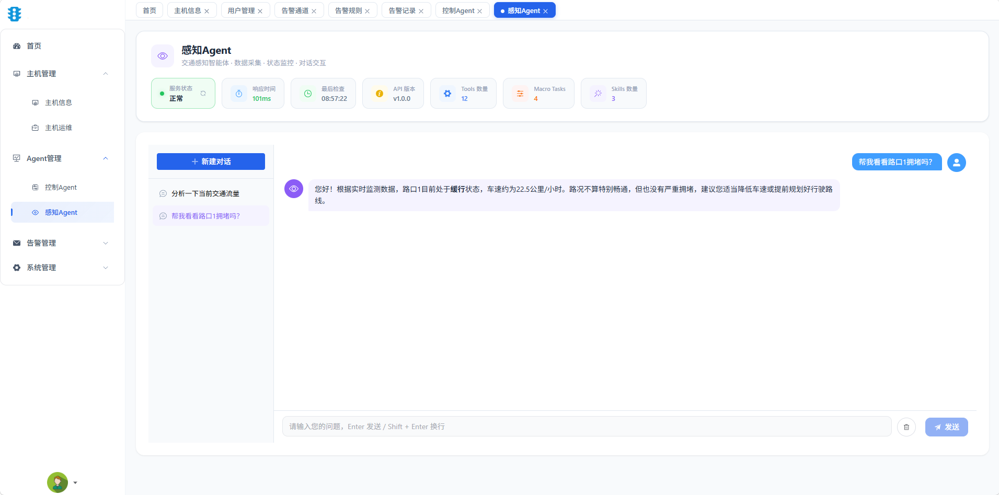

### Remote Operations
- **Remote Terminal** — Browser-based xterm terminal, routed through platform WebSocket Hub directly to Proxy PTY (color and resize support)
- **Remote File** — File browse, read, edit, upload, download, delete, and directory creation on proxy hosts (10MB single file limit, path traversal protection)
- **Process Control** — Start / stop / restart process commands sent from platform to Proxy

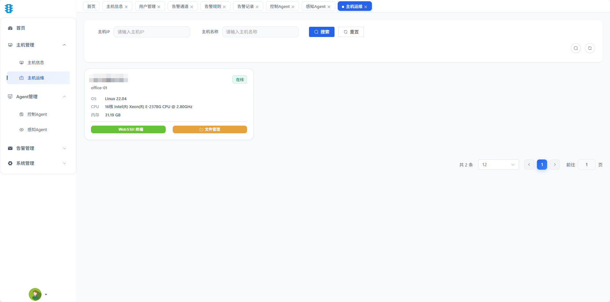
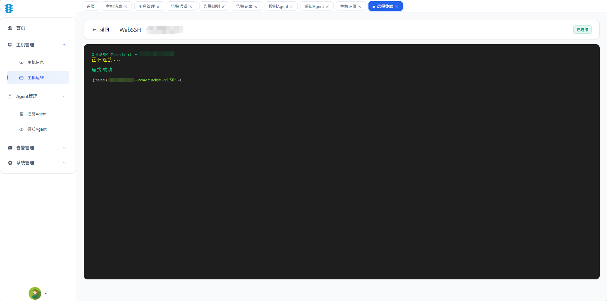
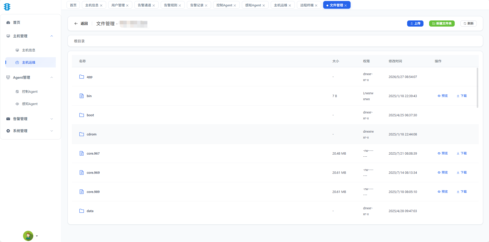

### System Logs
- **Operation Logs** — Automatically records protected interface operations via `OperLog` middleware
- **Login Logs** — Login success / failure records

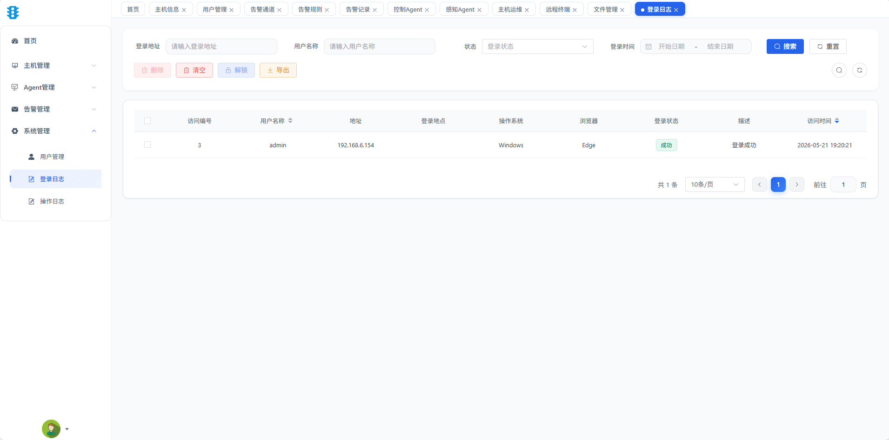

### Edge Proxy Features
- **System Info Collection** — Reports OS type/version, CPU arch/cores/model, memory, disk, MAC address on registration
- **System Metric Collection** — Reports CPU / memory / disk / network / load every 3 seconds
- **Process Monitoring** — Collects configured process running status, CPU usage, memory usage
- **Command Execution** — Receives platform-issued `startProcess` / `stopProcess` / `restartProcess` commands
- **WebSocket Long Connection** — Auto-reconnect (exponential backoff), heartbeat keepalive, safe goroutine shutdown
- **Remote Terminal** — PTY-based persistent shell sessions (5-minute timeout auto-close)
- **Remote File Management** — Complete file operations with path security validation

### Proxy Protocol Interfaces (Public, No Authentication)

| Method | Path | Description |
|--------|------|-------------|
| POST | `/api/v1/proxy/register` | Proxy first-time registration, reports hardware info |
| POST | `/api/v1/proxy/heartbeat` | Heartbeat keepalive + monitoring data report (3s cycle) |
| POST | `/api/v1/proxy/poll` | Poll pending commands (process start/stop) |
| POST | `/api/v1/proxy/ack` | Report command execution result |
| GET | `/api/v1/proxy/ws?ip=<host>` | WebSocket long connection (terminal/file) |

---

## Quick Start

### Prerequisites

- Go 1.25+ (Proxy build additionally requires Go 1.26+)
- Node.js 18+
- PostgreSQL 15+
- Redis 7+ (recommend preparing **two instances / two dbs**: platform and edge separated)

### Development Mode

#### 1. Clone Project

```bash
git clone <repository-url>
cd OpenTraffic-Ops
```

#### 2. Initialize Database

```sql
CREATE DATABASE rtm WITH ENCODING = 'UTF8';
```

```bash
psql -d rtm -f sql/01_sys_tables.sql
psql -d rtm -f sql/02_bu_tables.sql
psql -d rtm -f sql/03_chat_tables.sql
psql -d rtm -f sql/04_alarm_tables.sql
```

Create `~/.opentraffic-ops/config.yaml` (reference `backend/configs/config.yaml`), and modify database connection:

```yaml
datasource:
  host: 127.0.0.1
  port: 5432
  database: rtm
  username: postgres
  password: your_password
```

#### 3. Start Backend

```bash
cd backend
go mod download
go run cmd/server/main.go
```

Backend service starts at `http://localhost:18084`.

#### 4. Start Frontend

```bash
cd frontend
npm install
npm run dev
```

Frontend dev server starts at `http://localhost:80`, proxying `/dev-api` and `/dev-ws-api` to `127.0.0.1:18084`.

#### 5. Access System

Open browser and visit `http://localhost`. Default credentials:
- Username: `admin`
- Password: `admin123`

To deploy Proxy to a Linux host, see [`proxy/README.md`](proxy/README.md).

#### Windows Local Development Quick Debug (No dist copy needed)

During development, frontend changes are frequent. Set an environment variable to let the backend load frontend assets directly from disk:

```cmd
# In backend directory
set RTM_STATIC_DIR=..\frontend\dist
go run cmd\server\main.go
```

**Do not** set this variable for production builds, to ensure frontend resources are fully embedded in the binary.

---

## Server Deployment

### Production Build (Single Binary)

#### Windows Cross-Compile for Linux

Run `build-opentraffic-ops.bat` to generate Linux AMD64 and ARM64 binaries with frontend embedded:

```cmd
build-opentraffic-ops.bat
```

Output files:
- `backend\opentraffic-ops-linux-amd64`
- `backend\opentraffic-ops-linux-arm64`

Upload to Linux server and run:

```bash
mkdir -p ~/.opentraffic-ops
cp backend/configs/config.yaml ~/.opentraffic-ops/config.yaml
# Edit ~/.opentraffic-ops/config.yaml for production settings

chmod +x opentraffic-ops-linux-amd64
./opentraffic-ops-linux-amd64
```

#### Proxy Cross-Compilation

```batch
cd proxy
build-opentraffic-ops-proxy.bat
```

Output files:
- `proxy/dist/opentraffic-ops-proxy-linux-amd64`
- `proxy/dist/opentraffic-ops-proxy-linux-arm64`

> Proxy only supports Linux runtime; Windows / macOS are build hosts only.

### Configuration

The backend uses a single `config.yaml` file, always loaded from `~/.opentraffic-ops/config.yaml`, shared between development and production.

Before first run, create the config file (reference `backend/configs/config.yaml`):

```bash
# Linux / macOS
mkdir -p ~/.opentraffic-ops
cp backend/configs/config.yaml ~/.opentraffic-ops/config.yaml

# Windows
mkdir %USERPROFILE%\.opentraffic-ops
copy backend\configs\config.yaml %USERPROFILE%\.opentraffic-ops\config.yaml
```

Any key can be overridden via `RTM_` prefixed environment variables (`.` → `_`):

```bash
export RTM_DATASOURCE_HOST=192.168.1.100
export RTM_DATASOURCE_PASSWORD=secret
```

#### Key Configuration Items

```yaml
server:
  port: 18084
  mode: release        # debug / test / release

datasource:
  driver: postgres
  host: 127.0.0.1
  port: 5432
  database: rtm
  username: postgres
  password: ***

redis:
  platform:            # sessions, captcha, login locks, online users
    host: 127.0.0.1
    port: 6379
    db: 3
  edge:                # monitoring data / Proxy message queue
    host: 127.0.0.1
    port: 6379
    db: 1

jwt:
  header: Authorization
  secret: ***
  expireTime: 480      # minutes

agent:
  control: ""          # Control Agent external API address
  perceive: ""         # Perception Agent external API address
```

> Platform and edge Redis roles must be configured separately (can be different dbs on the same instance, or two separate instances).
> Agent configs are for interfacing with external Agent services; corresponding features are unavailable when empty.

### Logging

Logs are output via Zap, default writing to `logs/` directory, with size / day-based rotation:

```
logs/
├── opentraffic-ops-backend.log
└── opentraffic-ops-backend-*.log
```

Log configuration in `config.yaml`:

```yaml
log:
  level: info
  filename: logs/opentraffic-ops-backend.log
  maxSize: 100          # MB
  maxBackups: 30
  maxAge: 30            # days
  compress: true
```

---

## FAQ

### Database connection failed / migration error
- Verify PostgreSQL is running and accessible
- Check `datasource` config in `~/.opentraffic-ops/config.yaml`
- Ensure DDL scripts in `sql/` were executed in correct order

### Redis connection failed
- Verify Redis instances are running
- Check `redis.platform` and `redis.edge` configs
- Platform and edge Redis can be the same instance with different db numbers

### Frontend shows "Connection refused" to backend
- Ensure backend is running on port 18084
- Check Vite proxy config in `frontend/vite.config.js`
- For production, ensure `server.port` in config.yaml matches the expected port

### WebSocket terminal not connecting
- Check if the target Proxy is online (host status in platform)
- Verify token is passed correctly via query parameter
- Check firewall rules for WebSocket port

### Alarm notifications not sending
- Verify alarm channel configuration (email server, DingTalk webhook, etc.)
- Check alarm rules have correct thresholds and are enabled
- Review notification logs for send failure reasons

### Proxy not registering with platform
- Verify `platformUrl` in Proxy `config.json` points to correct platform address
- Check network connectivity between Proxy host and platform
- Ensure platform's `/api/v1/proxy/register` endpoint is reachable

---

## Acknowledgments

OpenTraffic Ops is built with the following open-source projects:

- [Go](https://golang.org/) / [Gin](https://github.com/gin-gonic/gin) / [GORM](https://gorm.io/) — Backend framework and ORM
- [Vue.js](https://vuejs.org/) / [Vite](https://vitejs.dev/) — Frontend framework and build tool
- [Element Plus](https://element-plus.org/) — UI component library
- [PostgreSQL](https://www.postgresql.org/) — Primary database
- [Redis](https://redis.io/) — Cache and messaging
- [Gorilla WebSocket](https://github.com/gorilla/websocket) — WebSocket implementation
- [Zap](https://github.com/uber-go/zap) — Logging
- [xterm.js](https://xtermjs.org/) — Browser terminal

[MIT License](../LICENSE)
