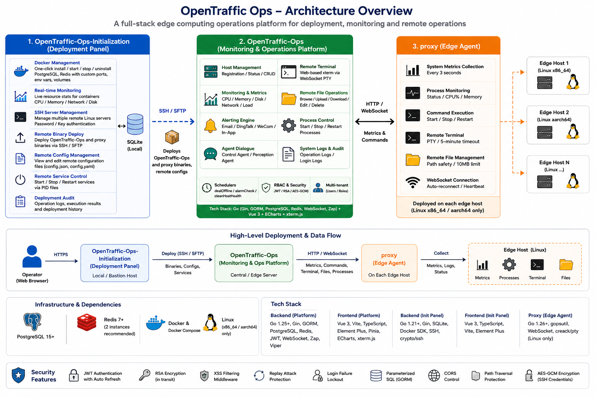
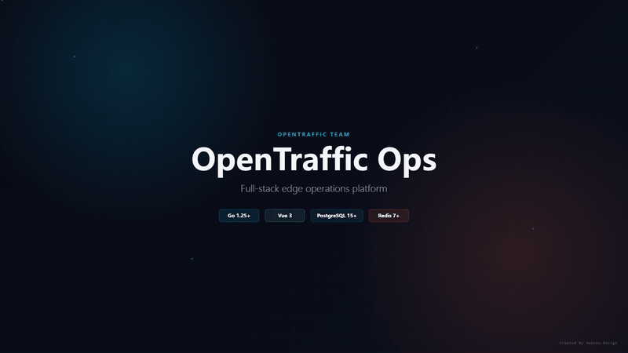

# OpenTraffic Ops

<div align="center">

[](LICENSE)
[](https://go.dev/)
[](https://vuejs.org/)
[](https://www.postgresql.org/)
[](https://redis.io/)

<br/>

[](https://huggingface.co/OpenTraffic)
[](https://x.com/OpenTraffic_CN)

</div>

<p align="center">
  <a href="README_CN.md">中文</a>
</p>

<p align="center">
  
</p>

<p align="center">
  <a href="images/OpenTraffic-Ops-Animation.mp4">
    
  </a>
</p>

<p align="center">
  <a href="https://github.com/OpenTraffic-Team/OpenTraffic-OPS">🌟 GitHub: OpenTraffic-Team/OpenTraffic-OPS</a>
</p>

A full-stack edge computing operations platform composed of two integrated subsystems: a **deployment panel** for infrastructure provisioning and a **monitoring platform** for edge host management, alerting, and remote operations.

---

## 📑 Table of Contents

- [🔧 Subsystems](#subsystems)
  - [1. OpenTraffic-Ops-Initialization — Deployment Panel](#1-opentraffic-ops-initialization--deployment-panel)
  - [2. OpenTraffic-Ops — Monitoring & Operations Platform](#2-opentraffic-ops--monitoring--operations-platform)
  - [3. proxy — Edge Agent](#3-proxy--edge-agent)
- [🔗 Relationship Between Subsystems](#relationship-between-subsystems)
- [🚀 Quick Start](#quick-start)
  - [📋 Prerequisites](#prerequisites)
  - [🖥️ Start the Deployment Panel](#start-the-deployment-panel)
  - [📊 Start the Monitoring Platform](#start-the-monitoring-platform)
  - [📦 Build Production Binaries](#build-production-binaries-windows-host-cross-compiling-to-linux)
- [📁 Project Structure](#project-structure)
- [📚 Documentation](#documentation)
- [🔒 Security Features](#security-features)
- [📄 License](#license)

---

## 🔧 Subsystems

### 1. OpenTraffic-Ops-Initialization — Deployment Panel

A single-binary, self-contained deployment dashboard that requires no external web server (Nginx) or database (PostgreSQL).

| Capability | Description |
|-----------|-------------|
| Docker Management | One-click install/start/stop/uninstall of middleware (PostgreSQL, Redis) with custom ports, env vars, volumes |
| Real-time Monitoring | Live resource stats (CPU / memory / network / disk) for containers |
| SSH Server Management | Centralized SSH connection configs for multiple remote Linux servers (password or key auth) |
| Remote Binary Deploy | Deploy `proxy` and `OpenTraffic-Ops` binaries to remote servers via SSH/SFTP |
| Remote Config Edit | View and edit remote configuration files (`opentraffic-ops-proxy-config.json`, `opentraffic-ops-config.yaml`) online |
| Remote Service Control | Start / stop / restart services on remote hosts via PID files |
| Deployment Audit | Full operation logs, execution results, and deployment history |

**Key Features:**
- **Docker Component Management**: One-click install/start/stop/uninstall of PostgreSQL, Redis with custom ports, environment variables, and data volumes
- **Real-time Monitoring**: Live component resource stats (CPU / memory / network / disk) with log auto-refresh
- **SSH Server Management**: Centralized management of multiple remote Linux server SSH configs, supporting both password and key authentication
- **Remote Binary Deployment**: One-click deploy `opentraffic-ops` and `opentraffic-ops-proxy` binaries to remote Linux servers via SSH/SFTP, with duplicate deployment detection
- **Remote Config Management**: Online view and edit of remote server configuration files
- **Remote Service Control**: Start/stop/restart services on remote hosts via PID files
- **Deployment Audit Trail**: Full operation logs and execution results for every deployment

**Tech Stack:** Go 1.21+ (Gin, SQLite, Docker SDK, `crypto/ssh`), Vue 3 + TypeScript + Vite, Element Plus

**Key Design:** Frontend is embedded into the Go binary via `go:embed`. The backend serves both API and SPA static files on a single port with custom SPA fallback logic — zero Nginx dependency.

[Details &rarr;](./OpenTraffic-Ops-Initialization/README.md)

---

### 2. OpenTraffic-Ops — Monitoring & Operations Platform

A full-stack monitoring and operations platform for edge computing scenarios. Consists of two deliverables: **monitoring platform service** (backend with embedded frontend via `go:embed`) and **edge proxy**.

| Capability | Description |
|-----------|-------------|
| Host Management | Edge node registration, CRUD, and status display (auto-enrolled on first proxy registration) |
| Health Metrics | Historical host health data with automatic daily rotation (7-day retention) |
| Alerting Engine | Multi-channel notifications (Email, DingTalk, WeCom, In-App), threshold-based rules for CPU / memory / disk / network / load |
| Remote Terminal | Browser-based xterm terminal through WebSocket hub to proxy PTY (colors, resize support) |
| Remote File Ops | Browse, read, edit, upload, download, delete files on proxy hosts (10MB limit, path traversal protection) |
| Process Control | Start / stop / restart processes on edge hosts via platform commands |
| Agent Dialogue | Conversational interaction with control and perception agents for operational assistance and host status queries |

**Key Features:**
- **System Management**: User management, personal center/profile management
- **Host Management**: Edge node CRUD, 7-day health history with automatic daily cleanup, operational entry points
- **Monitoring & Alerting**: Multi-channel alert notifications (Email, DingTalk, WeCom, In-App), threshold-based rules for CPU / memory / disk / network / load / host-offline / agent-offline, alert records, notification logs
- **Built-in Schedulers**: `dealOffline` (60s), `alarmCheck` (30s), `cleanHostHealth` (daily at 03:30)
- **Agent Dialogue**: Control agent and perception agent conversations, session management
- **Remote Operations**: Browser-based xterm terminal via WebSocket Hub + PTY, remote file operations (10MB limit, path traversal protection), process control (start/stop/restart)
- **System Logs**: Operation logs, login logs

**Tech Stack:**
- Backend: Go 1.25+ (Gin, GORM, PostgreSQL, Redis, JWT v5, Gorilla WebSocket, Zap, Viper)
- Frontend: Vue 3 + Vite, Element Plus, Pinia, ECharts, xterm.js
- Edge Proxy: Go 1.26+ (Linux only, amd64/arm64), gopsutil, Gorilla WebSocket, creack/pty

**Key Design:** The backend serves the SPA via `go:embed` as a single binary. The edge proxy (`proxy/`) is a separate Go module that communicates with the platform via HTTP/WebSocket — deployed independently on each monitored host.

[Details &rarr;](./OpenTraffic-Ops/README.md)

---

### 3. proxy — Edge Agent

Deployed on each monitored edge host. Responsible for system metrics collection and reporting to the platform server, with WebSocket remote control support (terminal / file management).

**Key Features:**
- System info collection (OS, CPU, memory, disk, MAC address)
- 3-second periodic metrics reporting (CPU / memory / disk / network / load)
- Process monitoring (running status, CPU%, memory usage)
- Command execution (startProcess / stopProcess / restartProcess)
- WebSocket long connection (auto-reconnect, exponential backoff, heartbeat keepalive)
- Remote terminal (persistent PTY shell, 5-minute timeout)
- Remote file management (path safety validation)

**Platform Support:** Linux x86_64 (amd64) and Linux ARM64 (aarch64) only. Windows and macOS can only be used for cross-compilation.

[Details &rarr;](./OpenTraffic-Ops/proxy/README.md)

---

## 🔗 Relationship Between Subsystems

```
+-----------------------------+      deploys      +-------------------------+
| OpenTraffic-Ops-Init        | ----------------> | OpenTraffic-Ops         |
| (this machine)              |  SSH/SFTP         | (remote Linux server)   |
|                             |                   |                         |
| - Docker mgmt               |      deploys      | - Host monitoring       |
| - SSH configs               | ----------------> | - Alerting              |
| - Binary deploy             |                   | - Remote ops            |
+-----------------------------+                   +-------------+-----------+
                                                                |
                                                                | HTTP / WebSocket
                                                                |
                                                     +----------v----------+
                                                     | proxy               |
                                                     | (on each edge host) |
                                                     | - Metrics collection|
                                                     | - Remote terminal   |
                                                     | - File operations   |
                                                     +---------------------+
```

1. **`OpenTraffic-Ops-Initialization`** is your control plane — run it on your local machine or a bastion host. It manages Docker containers (PostgreSQL, Redis) and deploys the monitoring stack to remote servers.

2. **`OpenTraffic-Ops`** runs as a server on a central or edge node. It collects metrics, triggers alerts, and provides the Web UI for operators.

3. **`proxy`** runs on each host you want to monitor. It reports metrics every 3 seconds and accepts remote commands (terminal, file, process) from the platform.

---

## 🚀 Quick Start

### 📋 Prerequisites

- Go 1.25+ (proxy build requires Go 1.26+)
- Node.js 18+
- Docker & Docker Compose (for `OpenTraffic-Ops-Initialization` container management)
- PostgreSQL 15+ (for `OpenTraffic-Ops`)
- Redis 7+ (two instances recommended: platform + edge)

### 🖥️ Start the Deployment Panel

```bash
cd OpenTraffic-Ops-Initialization/backend
go mod download
go run cmd/server/main.go
# Service runs on http://localhost:18080
```

### 📊 Start the Monitoring Platform

```bash
# 1. Create PostgreSQL database
psql -c "CREATE DATABASE rtm WITH ENCODING = 'UTF8';"

# 2. Start backend (first startup against an empty database auto-creates tables and the default admin/admin123 account)
cd OpenTraffic-Ops/backend
go mod download
go run cmd/server/main.go
# Service runs on http://localhost:18081

# 3. Start frontend (dev mode)
cd ../frontend
npm install
npm run dev
# Dev server on http://localhost:80
```

Default credentials for both systems: `admin` / `admin123` (the monitoring platform auto-creates this account on first startup against an empty database; change the password soon after)

### 📦 Build Production Binaries (Windows host cross-compiling to Linux)

```bash
# Monitoring platform (backend + embedded frontend)
cd OpenTraffic-Ops
build-opentraffic-ops.bat
# Outputs: backend/opentraffic-ops-linux-amd64, backend/opentraffic-ops-linux-arm64, backend/opentraffic-ops-linux-loong64

# Edge proxy
cd proxy
build-opentraffic-ops-proxy.bat
# Outputs: proxy/dist/opentraffic-ops-proxy-linux-amd64, proxy/dist/opentraffic-ops-proxy-linux-arm64, proxy/dist/opentraffic-ops-proxy-linux-loong64

# Deployment panel
cd ../../OpenTraffic-Ops-Initialization
build-opentraffic-ops-initialization.bat
# Outputs: backend/opentraffic-ops-init-linux-amd64, backend/opentraffic-ops-init-linux-arm64, backend/opentraffic-ops-init-linux-loong64
```

---

## 📁 Project Structure

```
opentraffic-ops/
├── OpenTraffic-Ops-Initialization/  # Deployment Panel
│   ├── backend/                     # Go backend (Gin, SQLite, Docker SDK)
│   ├── frontend/                    # Vue 3 + TypeScript SPA
│   ├── components/                  # Docker Compose templates
│   ├── docker-compose.yaml
│   └── README.md                    # (detailed)
│
├── OpenTraffic-Ops/                 # Monitoring & Operations Platform
│   ├── backend/                     # Go backend (Gin, GORM, PostgreSQL, Redis)
│   ├── frontend/                    # Vue 3 SPA
│   ├── proxy/                       # Edge proxy (Linux only, separate Go module)
│   ├── sql/                         # PostgreSQL DDL
│   ├── docs/                        # Design & deployment guides (Chinese)
│   └── README.md                    # (detailed)
│
├── README.md                        # This file
├── .gitignore                       # Root-level combined ignore rules
└── LICENSE                          # Apache License 2.0
```

---

## 📚 Documentation

- [OpenTraffic-Ops-Initialization README](./OpenTraffic-Ops-Initialization/README.md) — Deployment panel details
- [OpenTraffic-Ops README](./OpenTraffic-Ops/README.md) — Monitoring platform details
- [Proxy README](./OpenTraffic-Ops/proxy/README.md) — Edge proxy deployment guide

---

## 🔒 Security Features

- JWT token authentication with auto-refresh
- RSA password encryption in transit
- XSS filtering middleware
- Replay attack protection
- Login failure lockout
- Parameterized SQL queries (GORM)
- CORS control
- Remote file path traversal protection
- AES-GCM encryption for SSH credentials (in deployment panel)

---

## 📄 License

[Apache License 2.0](./LICENSE)
